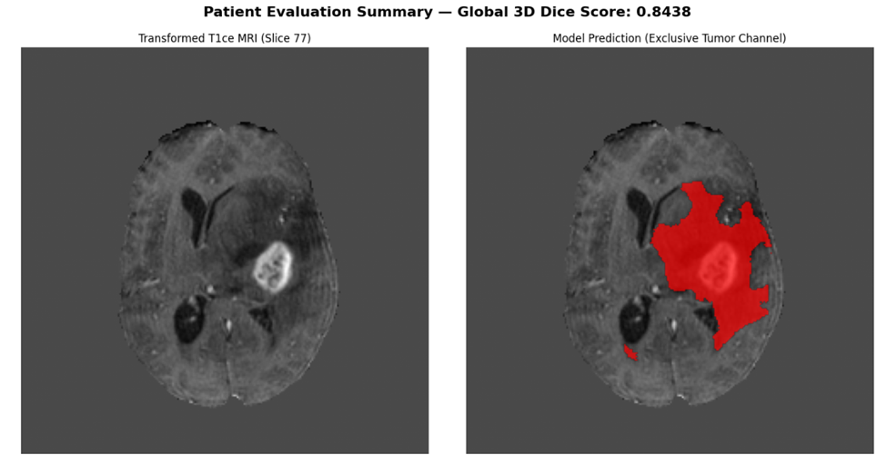
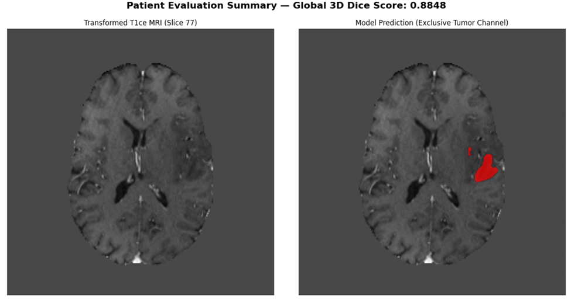

# 🧠 3D Brain Tumor Segmentation (BraTS) - PyTorch & MONAI

> **Work in Progress / Continuous Learning Project** > *This repository documents my ongoing exploration of Deep Learning architectures applied to complex 3D medical imaging.*

## 🎯 Project Objective
The goal of this project is to develop a 3D semantic segmentation pipeline capable of accurately identifying brain tumor sub-regions (Whole Tumor, Tumor Core, Enhancing Tumor) from multi-modal MRI scans (T1, T1ce, T2, FLAIR). 

This work is based on the benchmark **BraTS** dataset and leverages the **MONAI** (Medical Open Network for AI) framework on top of **PyTorch**.

## 💻 Hardware Environment & Repository Structure
To leverage high-performance GPU compute for 3D medical imaging, the training and inference pipelines are executed on **Kaggle**. 

* **Model Weights:** Due to GitHub's file size limitations, the trained model checkpoints (`.pth` files) and the raw BraTS NIfTI datasets are not hosted in this repository. 
* **Reproducibility:** The codebase is structured to be directly imported and run within a Kaggle notebook environment, pointing to the official BraTS dataset paths.

## ⚙️ Methodology and Architecture
To ensure scientifically rigorous results and avoid common machine learning biases, the pipeline is built on several core principles:

* **Strict Spatial Preprocessing:** Utilizing MONAI transforms to unify voxel spacing (`Spacingd`), normalize intensities independently per modality, and align tensors in physical space (RAS orientation).
* **Sliding Window Inference:** To overcome GPU VRAM limitations when processing massive 3D volumes, inference is performed via patches (e.g., 64x64x64) with a 50% overlap and Gaussian blending to smooth predictions at the borders.
* **Rigorous Quantitative Evaluation:** The custom `Smart Checkpointing` system does not rely on training loss reduction. Instead, it saves the model based strictly on improvements to the **3D Dice Score** calculated on an independent validation set, effectively preventing overfitting.

## 📊 Current Results
The current baseline model (a standard 3D U-Net architecture) demonstrates strong generalization capabilities on unseen patients, achieving global Dice scores of **~0.84 to ~0.89** on validation volumes.

*(Performance Overview: Transformed T1ce MRI vs. Model Prediction)*

> *Caption: Overlay of the exclusive tumor channel prediction (in red) on an axial slice of a T1ce MRI. Display generated directly from the Kaggle inference pipeline.*

## 🚀 Perspectives for Improvement (Next Steps)
This project reflects my commitment to continuous learning. Currently, the training loss shows signs of plateauing around 0.81. To break through this glass ceiling and handle highly complex cases, the next development steps are:

1. **Architectural Upgrade:** Transitioning from the baseline U-Net to a State-of-the-Art (SOTA) residual architecture like **SegResNet** or **SwinUNETR** to mitigate vanishing gradients in deep networks.
2. **Deep Supervision:** Implementing a hybrid loss function (`DiceCELoss`) applied across multiple resolution scales of the decoder, forcing the network to learn geometric features earlier in the training process.

---
*Feel free to explore the code or reach out with feedback. AI in medical imaging is a fascinating field where there is always room to iterate and improve!*